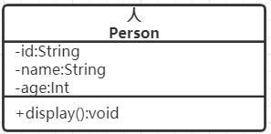
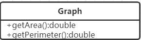
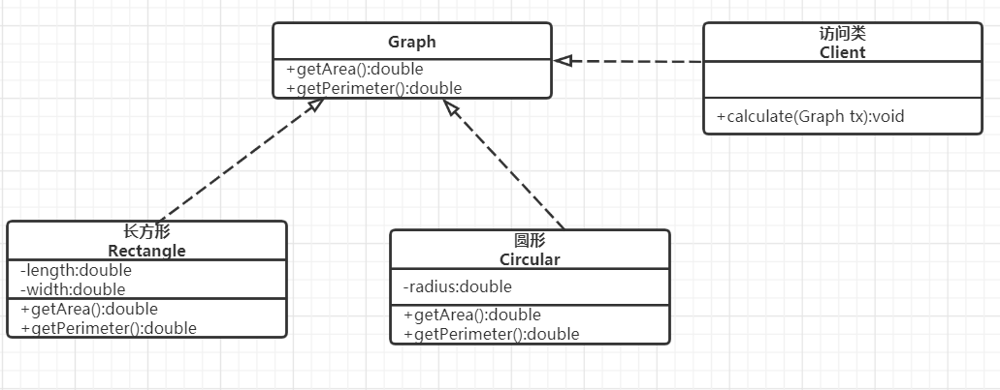
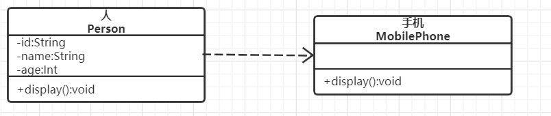
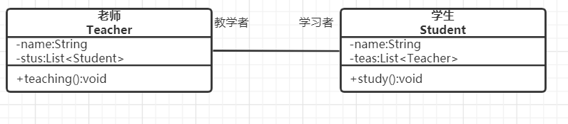
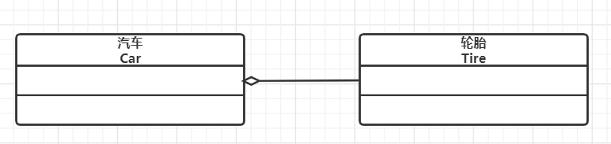
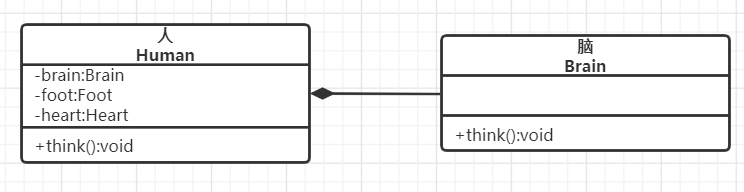
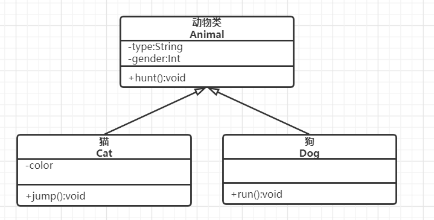
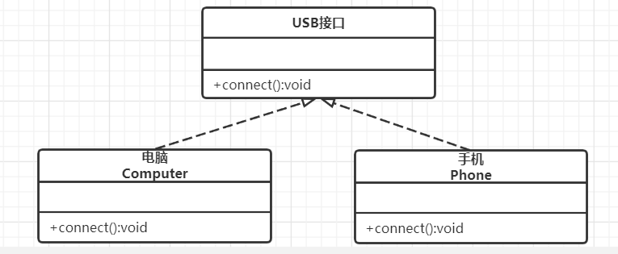

## UML类图

### 统一建模语言介绍

​		统一建模语言(Unified Modeling Language,UML)是用来设计软件蓝图的可视化建模语言,1997年被国际对象管理组织(OMG)采纳为面向对象的建模语言的国际标准.它的特点是简单,统一,图形化,能表达软件中的动态与静态信息.
​		统一建模语言能为软件开发的所有阶段提供模型化和可视化支持.而且融入了软件工程领域的新思想,新方法个新技术,使软件设计人员沟通更简明,进一步缩短了设计时间,减少开发成本.它的应用领域很宽,不仅适合于一般系统的开发,而且适合于并行与分布式系统的建模
​		UML从目标系统的不同角度出发,定义了用例图,类图,对象图,状态图,活动图,时序图,协作图,构件图,部署图等9种图.

​		推荐使用在线绘图网站(https://www.processon.com),可以方便快捷地绘制UML类图.

### 类,接口和类图

#### 1.类

​		类(class)是指具有相同属性,方法和关系的对象的抽象,它封装了数据和行为,是面向对象程序设计(OOP)的基础,具有封装性,继承性和多态性三大特征.在UML中,类使用包含类名,属性,和操作且带有分割线的矩形来表示.
​		(1)类名(Name)是一个字符串,例如,Person
​		(2)属性(Attribute)是指类的特性,即类的成员变量.UML按以下格式表示:
​		[可见性]属性名:类型[=默认值]
​		例如:-name:String
​		注意:"可见性"表示该属性对类外的元素是否可见,包括公有(Public),私有(Private),受保护(Protected)和默认(Friendly)四种,在类图中分别用符号+,-,#,~表示.
​		(3)操作(Operations)是类的任意一个实例对象都可以使用的行为,是类的成员方法,UML按以下格式表示:
​		[可见性]名称(参数列表)[:返回类型]

​		例如+display():void.	

​		图1所示是人类的UML表示.

图1 Person类

#### 2.接口

​		接口(interface)是一种特殊的类,它具有类的结构但不可被实例化,只可以被子类实现.它包含抽象操作,但不包含属性.它描述了类或组件对外可见的动作.在UML中,接口使用一个带有名称的小圆圈来进行表示.

​		图2所示是图形类接口的UML表示

图2 Graph接口

#### 3.类图

​		类图(ClassDiagram)是用来显示系统中的类,接口,协作以及它们之间的静态结构和关系的一种静态模型.它主要用于描述软件的结构化设计,帮助人们简化对软件系统的理解,它是系统分析与设计阶段的重要产物,也是系统编码与测试的重要模型依据.

​		图3所示是"计算长方形和圆形周长与面积"的类图,图形接口有计算面积和周长的抽象方法,长方形和圆形实现这两个方法供访问类调用.

图3 "计算长方形和圆形周长与面积"的类图

### 类之间的关系

​		在软件系统中,类不是孤立存在的,类与类之间存在着各种关系.根据类与类之间的耦合度从弱到强排列,UML中的类图有以下几种关系:依赖关系,关联关系,聚合关系,组合关系,泛化关系和实现关系.其中泛华和实现的耦合度相等,是最强的.

#### 1.依赖关系

​		依赖(Dependency)关系是一种使用关系,它是对象之间耦合度最弱的一种关联方式,是临时性的关联.在代码中,某个类的方法通过局部变量,方法的参数,或者对静态方法的调用来访问另一个类(被依赖类)中的某些方法来完成一些职责.	

​		在UML类图中,依赖关系使用带箭头的虚线来表示,箭头从使用类指向被依赖的类.图4所示是人与手机的关系图,人通过手机来展示自己.

图4 依赖关系的实例

#### 2.关联关系

​		关联(Association)关系是对象之间的一种引用关系,用于表示一类对象与另一类对象之间的联系,比如老师和学生,师傅和徒弟等.关联关系是类与类之间最常用的一种关系,分为一般关联关系,聚合关系和组合关系.
​		关联可以是双向的,也可以是单向的.在UML类图中,双向的关联可以用带两个箭头或者没有箭头的实线来表示,单向的关联用带一个箭头的实现来表示,箭头从使用类指向被关联的类.也可以在关联线的两端标注角色名,代表不同的角色.

​		在代码中通常将一个类的对象作为另一个类的成员变量来实现关联关系.

#### 3.聚合关系

​		聚合(Aggregation)关系是关联关系的一种,是强关联关系,是整体和部分之间的关系,是has-a的关系.
​		聚合关系也是通过成员对象来实现的,其中成员对象是整体对象的一部分,但是成员对象可以脱离整体对象而独立存在.例如,汽车和轮胎的关系,如果汽车因为其他原因(发动机,油箱等)原因报废,轮胎依然可以使用.

​		在UML类图中,聚合关系可以用带空心菱形的实线来表示,菱形指向整体.

​		图6所示是汽车和轮胎的关系图.

图6 聚合关系的实例

#### 4.组合关系

​		组合(Composition)关系也是关联关系的一种,也表示类之间的整体与部分的关系,但它是一种更强烈的聚合关系,是contains-a关系.
​		在组合关系中,整体对象可以控制部分对象的生命周期,一旦整体对象不存在,部分对象也将不存在,部分对象不能脱离整体对象而存在.例如,一个人死了,他的器官(脑,心脏等)也会很快失去生命力.

​		在UML类图中,组合关系用带实心菱形的实线来表示,菱形指向整体.	

​		图7所示是人和脑的关系

图7 组合关系的实例

#### 5.泛化关系

​		泛化(Generalization)关系是对象之间耦合度最大的一种关系,表示一般与特殊的关系,是父类与字类之间的关系,是一种继承关系,是is-a的关系.

​		在UML类图中,泛化关系用带空心三角箭头的实线来表示,箭头从子类指向父类.在代码实现时,使用面向对象的继承机制来实现泛化关系.

​		例如,Cat类和Dog类都是Animal类的子类,其类图如图8所示.

图8 泛化关系的实例

#### 6.实现关系

​		实现(Realization)关系是接口与实现类之间的关系.在这种关系中,类实现了接口,类中的操作实现了接口中所声明的所有抽象操作.

​		在UML类图中,实现关系使用带空心三角箭头的虚线来表示,箭头从实现类指向接口.例如,手机和电脑都实现了USB接口规范.

​		如图9所示,是电脑和手机实现USB规范的关系图.

图9 实现关系的实例

