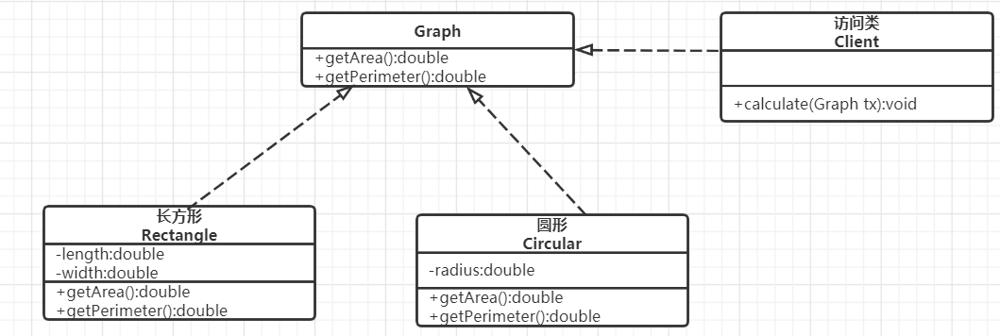
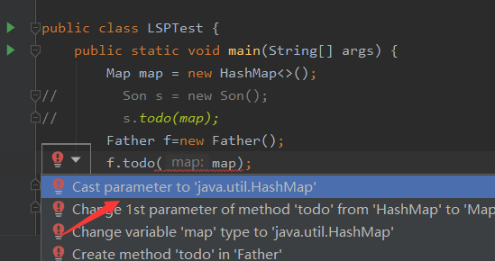

## 面向对象设计原则

​		在软件开发中,为了提高软件系统的可维护性和可复用性,增加软件的可扩展性和灵活性,根据7条原则来开发程序,可以大大提高软件开发效率,节约软件开发成本和维护成本.

### 一.开闭原则

#### 开闭原则的定义

​		开闭原则(Open Closed Principle,OCP):软件实体应当对扩展开放,对修改关闭(Software entities should be open for extension,but closed for modification).这里的软件实体包括以下几个部分:

​		:one:项目中划分出的模块

​		:two:类与接口

​		:three:方法


​		开闭原则的含义:当应用的需求改变时,在不修改软件实体的源代码或者二进制代码的前提下,可以扩展模块的功能,使其满足新的需求.

#### 开闭原则的作用

​		开闭原则是面向对象程序设计的终极目标,它使软件实体拥有一定的适应性和灵活性的同时具备稳定性和延续性.

​		:one:**对软件测试的影响**:软件遵守开闭原则的话,软件测试只需要对扩展的代码进行测试就可以了,因为原有的测试代码任然能够正常运行.

​		:two:**可以提高代码的可复用性**:粒度越小,被复用的可能性就越大;在面向对象的程序设计中,根据原子和抽象编程可以提高代码的可复用性

​		:three:**可以提高软件的可维护性**:遵守开闭原则的软件,其稳定性高和延续性强,从而易于扩展和维护


#### 开闭原则的实现方法

​		可以通过"抽象约束,封装变化"来实现开闭原则,即通过接口或者抽象类为软件实体定义一个相对稳定的抽象层,而将相同的可变因素封装在相同的具体实现类中.

​		抽象灵活性好,适应性广,只要抽象的合理,可以基本保持软件架构的稳定.而软件中容易变化的细节可以从抽象派生来的实现类来进行扩展,当软件需要变化时,只需要根据需求重新派生一个实现类来扩展就可以了.


下面以图形求面积周长为例

*分析*:一般的平面图形都有求面积和求周长的需求,这是共性,可以进行抽象.但是不同的图形的具体算法不同,这就是"变化"的部分.因此就可以将"求面积"和"求体积"抽象出来,定义一个接口Graph包含两个方法:求面积和求体积.而长方形和圆形可以实现这个接口,内部封装自己的属性和计算方法.外部访问只需要调用Graph的getArea()和gerPerimeter()就可以进行计算.其类图如图1所示.




<center>图1 图形计算面积周长类图</center>


### 二.里氏替换原则

#### 里氏替换原则的定义

​		里氏替换原则(Liskov Substitution Principle,LSP),继承必须确保超类所拥有的性质在子类中仍然成立(Inheritance should ensure that any property proved about supertype objects also holds for subtype objects).

​		里氏替换原则主要阐释了有关继承的一些原则,也就是什么时候应该使用继承,什么时候不应该使用继承,以及其中蕴含的原理.里氏替换原则是继承复用的基础,它反映了基类与字类之间的关系,是对开闭原则的补充,是对实现抽象化的具体步骤的规范.

​	

#### 里氏替换原则的作用

作用如下:

​		:one:里氏替换原则是实现开闭原则的重要方式之一

​		:two:它克服了继承中重写父类造成的可复用性变差的缺点

​		:three:他是动作正确性的保证.即类的扩展不会给已有的系统引入新的错误,降低了代码出错的可能性.

#### 里氏替换原则的四层含义

##### 1.子类可以实现父类的抽象方法,但不能覆盖父类的非抽象方法

里氏替换原则通俗来说就是:*子类可以扩展父类的功能,但不能改变父类原有的功能*.也就说:子类继承父类时,除添加新的方法完成新增功能外,尽量不要重写父类的方法.如果父类的某些方法在子类中已经发生"畸变",则建议断开父子继承关系,采用依赖,聚合,组合等关系代替继承.

```java
public class A {
    public int calc(int a, int b){
        return a+b;
    }
}

public class A1 extends A{
    @Override
    public int calc(int a, int b) {
        return a-b;
    }
}

public class Test{
    public static void main(String[] args) {
        A a = new A1();
        System.out.println("2+1=" + a.calc(2, 1));
    }
}

//运行结果:2+1=1
```

```tex
上面的例子中子类A1重写了父类已经实现过的方法calc(),造成结果的错误,正确的做法应该是A1新建一个方法添加自己的逻辑.如果通过重写父类的方法来完成新的功能,这样写起来虽然简单,但是整个继承体系的可复用性会比较差,特别是运用多态比较繁复时,程序运行出错的概率非常大.
```

##### 2.子类可以有自己的个性

子类可以扩展父类的功能.

```java
public class A {
    public int calc(int a, int b){
        return a+b;
    }
}

public class A1 extends A{
    public int calc1(int a, int b) {
        return a-b;
    }
}

public class Client{
    public static void main(String[] args) {
        A1 a = new A1();
        System.out.println("2-1=" + a.func2(2, 1));
    }
}

//运行结果:2-1=1
```

```tex
上面的例子就是对之前的进行改造,使其符合里氏替换原则.父类的方法calc()不去改动,而是添加calc1()方法来书写自己的逻辑,有自己的"个性",也符合规则.
```

##### 3.覆盖或实现父类的方法时,输入参数可以被放大

当子类的方法(重载或重写)父类方法时,方法的前置条件(方法的形参)要比父类方法的输入参数更宽松.这样就可以使用子类来代替父类.

```java
class Father {
    public void todo(HashMap map) {
        System.out.println("父类被执行...");
    }
}
class Son extends Father {
    public void todo(Map map) {
        System.out.println("子类被执行...");
    }
}
public class LSPTest {
    public static void main(String[] args) {
        HashMap map = new HashMap<>();
        Father f=new Father();
        f.todo(map);
    }
}

//运行结果:父类被执行...
```

```tex
上面的例子中,子类重载(参数类型不一致)了父类的todo()方法.根据里氏替换原则,父类出现的地方可以用子类代替,观看下面的代码.
```

```java
class Father {
    public void todo(HashMap map) {
        System.out.println("父类被执行...");
    }
}
class Son extends Father {
    public void todo(Map map) {
        System.out.println("子类被执行...");
    }
}
public class LSPTest {
    public static void main(String[] args) {
        HashMap map = new HashMap<>();
        Son s = new Son();
        s.todo(map);
    }
}

//运行结果:父类被执行...
```

```tex
结果依然是父类的方法被执行了.这样的代码是符合里氏替换原则的.那么这里为什么符合呢,分析一下:首先子类重载的方法todo()参数是Map,父类todo()方法的参数是HashMap,即子类方法参数类型比父类的更加宽松,当传入的是Hashmap时,子类中并没有这个方法todo(HashMap map),就会去父类中找,找到了就会调用父类的方法.所以就能使用子类来代替父类.
到了这里有些人可能还不明白,下面就举两个反例来说明一下:
```

```java
class Father {
    public void todo(HashMap map) {
        System.out.println("父类被执行...");
    }
}

class Son extends Father {
    public void todo(Map map) {
        System.out.println("子类被执行...");
    }
}


public class LSPTest {
    public static void main(String[] args) {
        Map map = new HashMap<>();
        Father f=new Father();
        f.todo(map);
    }
}

//运行结果:编译不通过
```

```tex
上面的这个例子显然会报错,父类的方法todo(HashMap map)中参数是HashMap,而传进去的却是Map,类型不匹配,也不能隐式转换.
```



```java
class Father {
    public void todo(Map map) {
        System.out.println("父类被执行...");
    }
}

class Son extends Father {
    public void todo(HashMap map) {
        System.out.println("子类被执行...");
    }
}


public class LSPTest {
    public static void main(String[] args) {
        HashMap map = new HashMap<>();
        Father f=new Father();
        f.todo(map);
    }
}

//运行结果:父类被执行...

```

```tex
这个例子中我们将父类的输入参数设置的比子类输入参数更加宽松,这时如果尝试使用子类去代替父类就不会成功.如下所示:
```

```java
class Father {
    public void todo(Map map) {
        System.out.println("父类被执行...");
    }
}

class Son extends Father {
    public void todo(HashMap map) {
        System.out.println("子类被执行...");
    }
}


public class LSPTest {
    public static void main(String[] args) {
        HashMap map = new HashMap<>();
        Son s = new Son();
        s.todo(map);
    }
}
//运行结果:子类被执行...
```


### 三.依赖倒置原则

#### 依赖倒置原则的定义

依赖倒置原则(Dependence Inversion Principle,DIP):高层模块不应该依赖底层模块,两者都应该依赖其抽象;抽象不应该依赖细节,细节应该依赖抽象(High level modules shouldnot depend upon low level modules.Both should depend upon abstractions.Abstracs should not depend upon details.Details should depend upon abstractions).核心思想是:*面向接口编程,不要面向实现编程*.


依赖倒置原则是实现开闭原则的重要途径之一,它降低了客户与实现模块之间的耦合.


在软件设计中,细节具有多变性,而抽象层则相对稳定,因此以抽象为基础搭建起来的架构要比以细节为基础搭建起来的架构要稳定得多.这里的抽象指的是接口或者抽象类,而细节是指具体的实现类.


使用接口或者抽象类的目的是制定好规范和契约,而不涉及任何具体的操作,把展现细节的任务交给它们的实现类去完成.


#### 依赖倒置原则的作用

:one:可以降低类之间的耦合性

:two:可以提高系统的稳定性

:three:可以减少并行开发引起的风险

:four:可以提高代码的可读性和可维护性


#### 依赖倒置原则的实现方法

依赖倒置原则的目的是通过面向接口编程来降低类之间的耦合性,在实际编程中只要遵循下面四点就可以满足这个规则:

:one:每个类尽量提供接口或抽象类,或者两者都具备

:two:变量的声明类型尽量是接口或者抽象类

:three:任何类都不应该从具体类派生

:four:使用继承时尽量遵循里氏替换原则

```java

interface Fly {
    void fly();
}

class Bird implements Fly {
    @Override
    public void fly() {
        System.out.println("bird can fly");
    }
}

class Butterfly implements Fly {

    @Override
    public void fly() {
        System.out.println("butterfly can fly");
    }
}

public class DIPTest {
    public static void main(String[] args) {
        Bird bird = new Bird();
        bird.fly();
        Butterfly butterfly = new Butterfly();
        butterfly.fly();
    }
}

//运行结果:
//bird can fly
//butterfly can fly
```


### 四.单一职责原则

#### 单一职责原则的定义

单一职责原则(Single Responsibility Principle,SRP)又称单一功能原则.这里的职责是指类变化的原因,单一职责原则规定一个类应该有且仅有一个引起它变化的原因,否则类应该被拆分(There should never be more than one reason for a class to change).


该原则提出对象不应该承担太多职责,如果一个对象承担了太多的职责,至少存在以下两个缺点:

:one:一个职责的变化可能会削或者抑制这个类实现其他职责的能力

:two:当客户端需要该对象的某一个职责时,不得不将其他不需要的职责全都包含进来,从而造成冗余代码或者代码的浪费.


#### 单一职责原则的优点

单一职责原则的核心是控制类的粒度大小,将对象解耦,提高其内部内聚性.如果遵循单一职责原则将有一下优点.

:one:降低类的复杂度.一个类只负责一项职责,其逻辑肯定要比负责多项职责的类简单得多

:two:提高类的可读性.复杂性降低,自然其可读性会提高

:three:提高系统的可维护性.可读性提高,维护起来就容易了

:four:变更引起的风险降低.变更是必然的,如果单一职责原则遵守得好,当修改一个功能时,可以显著降低对其他功能的影响.

#### 单一职责原则的实现

```java
class brandService{
    HashMap getBrandById(String Id){
        System.out.println("获取品牌");
        return null;
    }
}
class userService{
    void login(){
        System.out.println("用户登录");
    }
}
class orderService{
    List<HashMap> getOrdersByUid(String Uid){
        System.out.println("获取订单");
        return null;
    }
}

public class SRPTest {
    public static void main(String[] args) {
        brandService brandService = new brandService();
        userService userService = new userService();
        orderService orderService = new orderService();
        userService.login();
        brandService.getBrandById("1");
        orderService.getOrdersByUid("1");
    }
}

//运行结果:
    //用户登录
    //获取品牌
    //获取订单
```

```tex
上例中模仿一个简单的网购逻辑,将用户,品牌,订单等不同的模块分开.
```


### 五.接口隔离原则

#### 接口隔离原则的定义

接口隔离原则(Interface Segregation Principle,ISP):客户端不应该被迫依赖于它不使用的方法(Client should not be forced to depend on methods they do not use).

该原则还有另一个定义:一个类对另一个类的依赖应该建立在最小的接口上(The dependency of one class to another one should depend on the smallest possible interface).


接口隔离原则要求程序员尽量将臃肿庞大的接口拆分成更小的和更具体的接口,让接口中只包含客户感兴趣的方法.要为各个类建立它们需要的专用接口,而不要试图去建立一个很庞大的接口供所有依赖它的类去调用.


#### 接口隔离原则和单一职责原则的区别

接口隔离原则和单一职责原则都是为了提高类的内聚性,降低它们之间的耦合性,体现了封装的思想,但两者不同的是:

:one:单一职责原则注重的职责,而接口隔离原则注重的是对接口依赖的隔离

:two:单一职责原则注重的是约束类,它针对的是程序中实现和细节;接口隔离原则注重约束接口,主要针对抽象和程序整体架构

#### 接口隔离原则的优点

接口隔离原则是为了约束接口,降低类对接口的依赖性,遵循接口隔离原则的有以下5个优点:

:one:将臃肿庞大的接口分解为多个粒度小的接口,可以预防外来变更的扩散,提高系统的灵活性和可维护性.

:two:接口隔离提高了系统的内聚性,减少了对外交互,降低了系统的耦合性

:three:如果接口的粒度大小定义合理,能够保证系统的稳定性.但是,如果定义过小,则会造成接口数量过多,使设计复杂化;如果定义太大,灵活性降低,无法提供定制服务,给整体项目带来无法预料的风险.

:four:使用多个专门的接口还能够体现对象的层次,因为可以通过接口的继承,实现对总接口的定义.

:five:能减少项目工程的冗余代码.过大的接口里面通常放置许多不用的方法,当实现这个接口的时候,被迫加入冗余的代码.

#### 接口隔离原则的实现

在具体应用接口隔离原则时,应该根据以下几个规则来衡量:

:one:接口尽量小,但是要有限度.一个接口只服务于一个子模块或业务逻辑

:two:为依赖接口的类定制服务.只提供调用者需要的方法,屏蔽不需要的方法

:three:提高内聚,减少对外交互.使接口用最少的方法去完成最多的事情.

```java
interface animalAction{
    void fly();

    void jump();

    void swim();
}
class fish implements animalAction{

    @Override
    public void fly() {
        
    }

    @Override
    public void jump() {

    }

    @Override
    public void swim() {

    }
}
class bird implements animalAction{

    @Override
    public void fly() {
        
    }

    @Override
    public void jump() {

    }

    @Override
    public void swim() {

    }
}
class bunny implements animalAction{

    @Override
    public void fly() {
        
    }

    @Override
    public void jump() {

    }

    @Override
    public void swim() {

    }
}
```

```tex
上面的例子中定义了一个animalAction接口,表示动物行为.然后bird类实现这个接口,却多出了swim()方法,后面的fish类多出了fly()和jump(),bunny类多出了fly()和swim().有很严重的接口污染问题,需要进行接口隔离.修改后的代码如下所示:
```

```java

interface swimAction{
    void swim();
}
interface flyAction{
    void fly();
}
interface jumpAction{
    void jump();
}

class bunny implements jumpAction{
    @Override
    public void jump() {
    }
}
class bird implements flyAction,jumpAction{
    @Override
    public void fly() {
    }
    @Override
    public void jump() {
    }
}
class fish implements swimAction{
    @Override
    public void swim() {
        
    }
}
```

```tex
修改过后的接口分为三个小接口:swimAction,flyAction,jumpAction;当fish,bird,bunny类需要对应的功能时,只需要实现对应的接口即可,不会有冗余代码.
```


### 六.迪米特法则

#### 迪米特法则的定义

迪米特法则(Law of Demeter,LoD),又叫最少知识原则(Least Knowledge Principle,LKP).只与你的直接朋友交谈,不和"陌生人"说话(Talk only to your immediate friends and not to strangers).

其含义是:如果两个软件实体无须直接通信,那么就不应当发生直接的相互调用,可以通过第三方转发该调用.其目的是降低类之间的耦合度,提高模块的相对独立性.

迪米特法则中的"朋友"是指:当前对象本身,当前对象的成员对象,当前对象所创建的对象,当前对象的方法参数等.这些对象同当前对象存在关联,聚合或组合关系,可以直接访问这些对象的方法.


#### 迪米特法则的优点

迪米特法则要求限制软件实体之间通信的宽度和深度,正确使用迪米特法则将有以下两个优点:

:one:降低了类之间的耦合度,提高了模块的相对独立性

:two:由于亲和度降低,从而提高了类的可复用率和系统的扩展性


如果过度使用迪米特法则会使系统产生大量的中介类,从而增加系统的复杂性,使模块之间的通信效率降低.所以在采用迪米特法则时需要反复权衡,确保高内聚和低耦合的同时,保证系统的结构清晰.


#### 迪米特法则的实现

从迪米特法则的定义和特点可知,它强调以下两点:

:one:从依赖者的角度来说,只依赖应该依赖的对象

:two:从被依赖着的角度来说,只暴露应该暴露的方法

所以,在运用迪米特法则时要注意以下6点:

:one:在类的划分上,应该创建弱耦合的类.类与类之间的耦合越弱,就越有利于实现可复用的目标

:two:在类的结构设计上,尽量降低类成员的访问权限

:three:在类的设计上,优先考虑将一个类设置成不变类

:four:在对其他类的引用上,将引用其他对象的次数降到最低

:five:不暴露类的属性成员,而应该提供相应的访问器(set和get方法)

:six:谨慎使用序列化(Serializable)功能


```java
class QQGetMessage{
    public void receiveMsg(){
        System.out.println("手机接收电信号");
    }
    public void unwrapData(){
        System.out.println("数据包逐层解码");
    }
    public void getQQMsg(){
        System.out.println("应用层获取QQ程序对应的数据");
    }
    public void showMsgOnQQ(){
        System.out.println("显示给用户");
    }
}
class Client{
    public void chat(){
        QQGetMessage qqGetMessage = new QQGetMessage();
        qqGetMessage.receiveMsg();
        qqGetMessage.unwrapData();
        qqGetMessage.getQQMsg();
        qqGetMessage.showMsgOnQQ();
    }
}
```

```tex
上面的这段代码中,我们普通用户接收QQ消息,不需要知道那么多QQ内部的实现细节,只需要知道接收消息即可,而上面的用户Client却调用了四个方法才拿到数据.这很明显知道的太多了,不符合迪米特法则.可以将上面的代码改成以下模式:
```

```java
class QQGetMessage {
    public void receiveMsg() {
        System.out.println("手机接收电信号");
    }

    public void unwrapData() {
        System.out.println("数据包逐层解码");
    }

    public void getQQMsg() {
        System.out.println("应用层获取QQ程序对应的数据");
    }

    public void showMsgOnQQ() {
        System.out.println("显示给用户");
    }

    public void getReadableMsg() {
        receiveMsg();
        unwrapData();
        getQQMsg();
        showMsgOnQQ();
    }
}

class Client {
    public void chat() {
        QQGetMessage qqGetMessage = new QQGetMessage();
        qqGetMessage.getReadableMsg();
    }
}
```

```tex
这样就将QQ内部的细节隐藏起来了,对外只暴露Client所需要的即可.还有一个典型的例子就是:传统的JDBC操作总共需要四部操作:1.加载驱动 2.获取连接 3.增删改查 4.处理结果集数据;这四个步骤其实是比较麻烦的,spring的templete就很好地将实现细节封装起来,对外暴露简单的API.
```


### 七.合成复用原则

#### 合成复用原则的定义

合成复用原则(Composite Reuse Principle,CRP)又叫组合/聚合复用原则(Composition/Aggregate Reuse Principle,CARP).它要求在软件复用时,要尽量先使用组合或者聚合等关联关系来实现,其次才考虑使用继承关系来实现.

如果要使用继承关系,则必须严格遵循里氏替换原则.合成复用原则和里氏替换原则是相辅相成的,两者都是开闭原则的具体实现规范.

#### 合成复用原则的优缺点

通常类的复用分为继承复用和合成复用两种, 继承复用虽然有简单和易于实现的优点,但它也存在以下缺点.

:one:继承复用破坏了类的封装性.因为继承会将父类的实现细节暴露给子类,父类对子类是透明的,所以这种复用又称为"白箱"复用

:two:子类与父类的耦合度高.父类的实现的任何改变都会导致子类的实现发生变化,这不利于类的扩展与维护

:three:它限制了复用的灵活性.从父类继承而来的实现是静态的,在编译时已经定义.所以在运行时不可能发生变化


采用组合或聚合复用时,可以将已有对象纳入新对象中,使之成为新对象的一部分,新对象可以调用已有对象的功能,它有以下优点:

:one:它维持了类的封装性.因为成分对象的内部细节是新对象看不见的,所以这种复用又称为"黑箱"复用

:two:新旧类之间的耦合度低.这种复用所需的依赖较少,新对象存取成分对象的唯一方法是通过成分对象的接口.

:three:复用的灵活性高.这种复用可以在运行时动态进行,新对象可以动态地引用与成分对象类型相同的对象.

#### 合成复用原则的实现


```java
abstract class Size{
    public abstract void size();
}
class SmallDog extends Size{
    @Override
    public void size() {
        System.out.println("小型狗");
    }
}
class MiddleDog extends Size{
    @Override
    public void size() {
        System.out.println("中型狗");
    }
}
class BigDog extends Size{
    @Override
    public void size() {
        System.out.println("大型狗");
    }
}
//血统种类
abstract class BreedType{
    public abstract void breedtype();
}
class MixDog extends BreedType{
    @Override
    public void breedtype() {
        System.out.println("混血狗");        
    }
}
class PureDog extends BreedType{
    @Override
    public void breedtype() {
        System.out.println("纯种狗");
    }
}

class Dog{
    private Size size;
    private BreedType breedType;

    public Size getSize() {
        return size;
    }

    public void setSize(Size size) {
        this.size = size;
    }

    public BreedType getBreedType() {
        return breedType;
    }

    public void setBreedType(BreedType breedType) {
        this.breedType = breedType;
    }
}

public class CRPTest {
    public static void main(String[] args) {
        Dog dog = new Dog();
        //组合大型纯种狗
        dog.setSize(new BigDog());
        dog.setBreedType(new PureDog());
        //组合中型混血狗
        dog.setSize(new MiddleDog());
        dog.setBreedType(new MixDog());
    }
}
```


## 总结

这7种设计原则是软件设计模式必须尽量遵循的原则,各种原则要求的侧重点不同.其中,开闭原则是总纲,它告诉我们要对扩展开放,对修改关闭;里氏替换原则告诉我们不要破坏继承体系;依赖倒置原则告诉我们要面向接口编程;单一职责原则告诉我们实现类要职责单一;接口隔离原则告诉我们要在设计接口的时候要精简单一;迪米特法则告诉我们要降低耦合度;合成复用原则告诉我们要优先使用组合或者聚合关系复用,少用继承关系复用.


