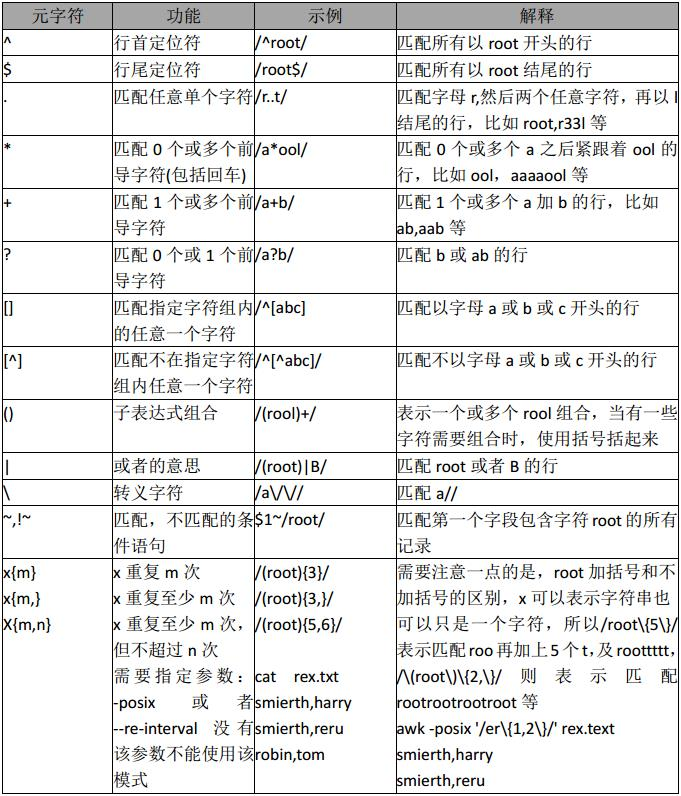

---


title: awk学习记录一
date: 2020-07-07 20:50:05
tags: [linux,awk]
---


## AWK简介

```te
	awk是一个强大的文本分析工具,可以方便地对数据进行分析并生成报告.awk其实也是一个简单的程序设计语言.它的使用方法是:
	awk '{pattern+action}'{filenames}
```

## AWK使用说明

```bash
Usage: awk [POSIX or GNU style options] -f progfile [--] file ...
Usage: awk [POSIX or GNU style options] [--] 'program' file ...
POSIX options:		GNU long options: (standard)
	-f progfile		--file=progfile
	-F fs			--field-separator=fs
	-v var=val		--assign=var=val
Short options:		GNU long options: (extensions)
	-b			--characters-as-bytes
	-c			--traditional
	-C			--copyright
	-d[file]		--dump-variables[=file]
	-e 'program-text'	--source='program-text'
	-E file			--exec=file
	-g			--gen-pot
	-h			--help
	-L [fatal]		--lint[=fatal]
	-n			--non-decimal-data
	-N			--use-lc-numeric
	-O			--optimize
	-p[file]		--profile[=file]
	-P			--posix
	-r			--re-interval
	-S			--sandbox
	-t			--lint-old
	-V			--version

To report bugs, see node `Bugs' in `gawk.info', which is
section `Reporting Problems and Bugs' in the printed version.

gawk is a pattern scanning and processing language.
By default it reads standard input and writes standard output.

Examples:
	gawk '{ sum += $1 }; END { print sum }' file
	gawk -F: '{ print $1 }' /etc/passwd
```

## 测试文件准备

test.txt

```tex
root:x:0:0:root:/root:/bin/bash
bin:x:1:1:bin:/bin:/sbin/nologin
daemon:x:2:2:daemon:/sbin:/sbin/nologin
adm:x:3:4:adm:/var/adm:/sbin/nologin
lp:x:4:7:lp:/var/spool/lpd:/sbin/nologin
hello-awk-java-python-unix-8888
hello-awk-java-linux-unix-8888
hello-kkk-java-linux-unix-8888
hello-awk-jjj-linux-unix-8888-1
hello-awk-jjj-linux-unix-8888-2
hello-awk-jjj-linux-unix-8888-3
hello-awk-jjj-linux-unix-8888-4
```

t2.txt

```tex
红豆生南国
春来发几枝

愿君多采撷
此物最相思
```


## awk运行机制

### 实例一

```bash
awk '{print $0}' test.txt
```


```te
	这里是将test.txt文件中的每一行数据作为输入,然后执行'{}'代码块中的逻辑,也就是打印每一条数据.
```

### 实例二

```bash
awk '{print "hello,world"}' test.txt
```


```te
	可以看到这个例子中,也是将test.txt文件中的每一行数据作为输入,然后执行'{}'代码块中的逻辑,每一行都打印一次"hello,world"
```

### 实例三

```bash
awk -F ":" '{print $1}' test.txt 
```

```te
	将test.txt文件中的每一行数据作为输入,并且按照":"分割每一行数据,输出每一行的第一域内容
```


### 实例四

```bash
awk -F ":" '{print $1 $3}' test.txt 
```

```tex
	输出第一域和第三域
```


### 实例五

```bash
awk -F "-" '{print "first:" $1 "\t third:" $3}' test.txt
```

```tex
	用"-"分割每一行数据,然后将拼接字符串输出结果
```


### 实例六

```bash
awk -F "-" '{if (NR>=6&&NR<=10) print $3}' test.txt 
```

```tex
	用"-"分割数据,打印第六行到第十行的域三数据
```


实例七

```bash
awk -F "-" '{print $1 "--- " $6}' test.txt 
```

```tex
	用"-"将数据分割,然后拼接输出域一和域三数据
```


## begin和end

```tex
	综上所述,对于每一行输入数据,awk会将代码块中的代码都执行一次.有些情况下需要在处理文本之前初始化代码(begin),有时又需要在结束时做一些操作(end).就相当于java测试中的@Before和@After注解.
	begin代码块一般用于初始化字段分隔符,全局变量初始化.
	end代码块一般用于最终计算或打印应该出现在末尾的信息
```

### 实例一

```bash
awk '{count ++;print $0}; END{print "context count is ",count}' test.txt 
```

```tex
	定义变量,逐行打印每一行数据,变量递增,最后打印END块中的语句
```


### 实例二

```bash
awk 'BEGIN {count=0;print "start num is "count} {count=count+1;print $0} END{print "end num is ",count}' test.txt 
```

```tex
	定义变量,在BEGIN块中输出变量的值,逐行输出每行数据,变量递增,在END块中输出变量最终的值.
```


### 实例三

```bash
awk -F "-" 'BEGIN{num=0;} {num=num+$7} END{print num}' test.txt 	
```

```tex
	以"-"分割数据,在begin块中定义变量,逐行累加域七的数据,在end块中输出	
```


## 运算符

### 赋值运算符

```bash
awk 'BEGIN{a=5;a+=5;print a}'
```


### 逻辑运算符

```bash
awk 'BEGIN{a=1;b=2;print (a>2&&b>1,a=1||b>1)}'
```

```tex
	a>2不成立,所以结果为0,即false,a=1||b>1成立,所以结果为1,即为true;
```


### 关系运算符

```bash
awk 'BEGIN{a=2;b=1;if(a>=b){print "yes"}}'
```


```tex
	值得注意的是,如果拿字符串和和数字比较,会统一使用ascii码顺序比较
```

```bash
awk 'BEGIN{a=2;b="a";if(a>=b){print "yes"}}'
```

```tex
	a变量2的ASCII码值是50,b变量"a"的ASCII码值是97,所以没有输出.
```


### 算术运算符

```tex
算术运算符在运算时,遇到非数值的都会将其转换为0
```

```bash
awk 'BEGIN{a="20asd3";print a++}'
awk 'BEGIN{a="20asd3";print a}'
```


### 三目运算符

```bash
awk 'BEGIN{a="a";print a=="a"?"yes":"no"}'
```


## 内置变量

| 变量名 | 属性                              |
| ------ | --------------------------------- |
| $0     | 当前记录                          |
| $1~$n  | 当前记录的第n个字段               |
| FS     | 输入字段分隔符                    |
| RS     | 输入记录分隔符 默认为换行符       |
| NF     | 当前记录中的字段个数,就是有多少列 |
| NR     | 已经读出的记录数 即行号,从1开始   |
| OFS    | 输出字段分隔符,默认是空格         |
| ORS    | 输出的记录分隔符,默认是换行符     |

### 字段分隔符FS

```bash
awk 'BEGIN {FS="-"}{print $1 "\t" $2}' test.txt 
```

```tex
	分割符为"-",打印域一和域三的数据
```


### 字段数量NF

```bash
awk -F "-" 'NF==7{print $0}' test.txt
awk -F "-" 'NF==1{print $0}' test.txt
```

```te
	按照"-"分割数据,分别输出分割后的字段数量为7和1的行
```


### 数量记录NR

```bash
awk '{print NR "----" $0}' test.txt
```

```te
	将NR记录作为每一行的行号拼接在开始位置
```


### 记录分隔符RS

```bash
awk 'BEGIN{FS="\n";RS=""}{print $1" "$2}' t2.txt
```

```te
	FS为"\n"表示每个字段都占据一行,RS为""表示一条记录的分隔符是空白分隔符.下面的唐诗中间有一行都是空白分隔符,将每一行整行切割,所以这里的计量单位就变成了一条记录,一条记录中被切割两次,有两个域,域一为第一行数据,域二为第二行数据.
```


### 输出字段分隔符 OFS

```bash
awk 'BEGIN{FS="-";OFS="#"}{print $1,$2,$3}' test.txt
```

```tex
	按照"-"分割每行数据,打印输出分割符"#"
```


### 输出记录分隔符 ORS

```bash
#!/bin/awk
BEGIN{
        FS="\n"
        RS=""
        ORS="\n\n"
}
{
        print $1 "  " $2
}
```

```bash
awk -f ORS_awk t2.txt 
```

```tex
	 这里将awk命令写入awk脚本,使用-f执行对应脚本.输出记录符为ORS,ORS为"\n\n",所以记录之间的间隔为两行(空一行).
```


## 正则表达式

### 总览



### 示例一

```tex
	awk+正则表达式的语法是awk '/REG/{logic}' file,/REG/为正则表达式.
	以下示例表示打印行中包含linux字段的行
```

```bash
awk '/linux/{print $0}' test.txt
```


### 示例二

```bash
awk 'BEGIN{a="hello123java";if(a~/123/){print "ok"}}'
```

```tex
	定义字符串"hello123java",判断字符串中是否包含"123"
```


## 循环流程控制和数组

### 流程控制if

```bash
!/bin/awk
BEGIN{
	FS="-"
}

{
	if($0 ~ /linux/){
		}else{
		print "cannot find \"linux\" !"	
		} 
}
```


```bash
awk -f if_awk test.txt 
```

```tex
	分隔符是"-",如果改行包含linux字段,不做操作,如果没有则输出"cannot find linux !"
```


### 循环

#### while

```tex
while格式:
while(表达式)
{语句}
```


```bash
awk 'BEGIN{ test=1000; total=0; while(i<=test) {     total+=i;     i++; } print total; }'
```

```tex
	从1累加到1000
```


#### for

```tex
格式1:

for(变量 in 数组)

{语句}


格式2:
for(变量;条件;表达式)
{语句}
```

```bash
awk 'BEGIN{ for(k in ENVIRON) {     print k"="ENVIRON[k]; } }'
```

```tex
	遍历输出系统环境变量值,ENVIRON是一个数组
```


```bash
awk 'BEGIN{ total=0; for(i=0;i<=100;i++) {     total+=i; } print total; }'
```


