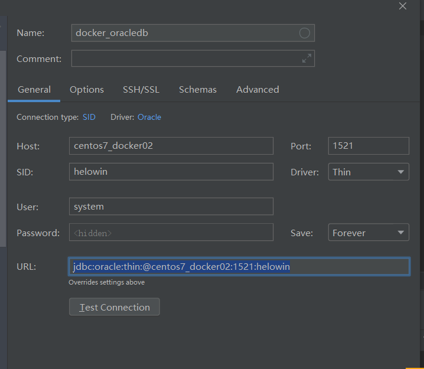
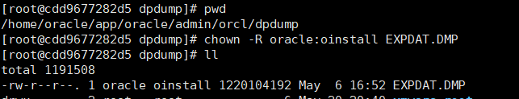
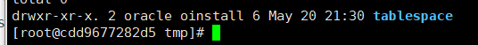

## 启动docker服务

`systemctl start docker`

`systemctl daemon-reload`

## 拉取oracle镜像

`docker pull registry.cn-hangzhou.aliyuncs.com/helowin/oracle_11g` 

## 创建容器

`docker run -d -p 1521:1521 -v /tmp:/home/oracle/app/oracle/admin/orcl/dpdump --name oracle11g_wuchuan registry.cn-hangzhou.aliyuncs.com/helowin/oracle_11g`

## 启动容器

`docker start oracle11g_wuchuan`

## 进入容器内部,设置oracle信息

`docker exec -it oracle11g_wuchuan bash`

### 切换到root用户，这是在容器内部切换(密码helowin)

`su root`

### 编辑环境变量文件profile /etc/profile

`vi /etc/profile`

### 在profile /etc/profile文件末尾加上以下内容

`export ORACLE_HOME=/home/oracle/app/oracle/product/11.2.0/dbhome_2` 

`export ORACLE_SID=helowin` 

`export PATH=$ORACLE_HOME/bin:$PATH`

### source文件使配置文件生效

`source /etc/profile`

### 切换到Oracle账户，注意是在容器内部切换,还有要带上"-",否则配置文件不生效

`su - oracle`

### 启动Oracle命令行工具

`sqlplus /nolog`

`conn /as sysdba`

`alter user system identified by oracle;`

`alter user sys identified by oracle;`

`alter profile default limit password_life_time unlimited;`

### 退出命令行工具

`quit`

### 退出容器

`exit`

### 查看是否在最外层

`docker ps`

## 使用工具连接

`jdbc:oracle:thin:@centos7_docker02:1521:helowin`

## 安装上传工具并上传文件

`yum install -y lrzsz`

`cd /tmp`

`rz`

## 修改oracle用户组

### 进入容器

`docker exec -it oracle11g_wuchuan bash`

### 查看oracle用户组

`cd /home/oracle`

`ll`

### 进入docker卷目录

`cd /home/oracle/app/oracle/admin/orcl/dpdump/`

## 修改权限

### 切换root用户,密码为helowin

`su root`

`chown -R oracle:oinstall EXPDAT.DMP`

## 创建表空间文件夹并修改权限

`mkdir -p /tmp/tablespace`

`chown -R oracle:oinstall /tmp/tablespace`

## 新建用户并导入数据到指定表空间

### 切换回oracle用户(注意要使用su -,确保加载root环境,否则oracle用户无法识别sqlplus命令)

`su - oracle`

### 启动Oracle命令行工具,连接到sysdba账户，设置用户名，密码

`sqlplus /nolog`

`conn /as sysdba`

### 创建表空间

`CREATE TABLESPACE NNC_WUCHUAN_DATA01 DATAFILE '/tmp/tablespace/nnc_data01.dbf' SIZE 500M AUTOEXTEND ON NEXT 50M EXTENT MANAGEMENT LOCAL UNIFORM SIZE 256K ;`

 `CREATE TABLESPACE NNC_WUCHUAN_DATA02 DATAFILE '/tmp/tablespace/nnc_data02.dbf' SIZE 300M AUTOEXTEND ON NEXT 50M EXTENT MANAGEMENT LOCAL UNIFORM SIZE 256K ;` 

`CREATE TABLESPACE NNC_WUCHUAN_DATA03 DATAFILE '/tmp/tablespace/nnc_data03.dbf' SIZE 500M AUTOEXTEND ON NEXT 100M EXTENT MANAGEMENT LOCAL UNIFORM SIZE 512K ;` 

`CREATE TABLESPACE NNC_WUCHUAN_INDEX01 DATAFILE '/tmp/tablespace/nnc_index01.dbf' SIZE 500M AUTOEXTEND ON NEXT 50M EXTENT MANAGEMENT LOCAL UNIFORM SIZE 128K ;`

 `CREATE TABLESPACE NNC_WUCHUAN_INDEX02 DATAFILE '/tmp/tablespace/nnc_index02.dbf' SIZE 300M AUTOEXTEND ON NEXT 50M EXTENT MANAGEMENT LOCAL UNIFORM SIZE 128K ;` 

`CREATE TABLESPACE NNC_WUCHUAN_INDEX03 DATAFILE '/tmp/tablespace/nnc_index03.dbf' SIZE 500M AUTOEXTEND ON NEXT 100M EXTENT MANAGEMENT LOCAL UNIFORM SIZE 256K ;`

### 创建新用户

`CREATE USER NCC_10 IDENTIFIED BY 123456 DEFAULT TABLESPACE NNC_WUCHUAN_DATA01 TEMPORARY TABLESPACE temp;`

### 给新用户授权

`GRANT connect,dba to NCC_10 ;`

### 退出oracle

`quit`

### 导入数据

`impdp NCC_10/123456@helowin DUMPFILE=EXPDAT.DMP DIRECTORY=DATA_PUMP_DIR remap_schema=ORCL:NCC_10 remap_tablespace=NNC_DATA01:NNC_WUCHUAN_DATA01,NNC_INDEX01:NNC_WUCHUAN_INDEX01`

## 遇到过的错误

1. ### ORA-12899: value too large for column (actual: 27, maximum: 20)错误解决

oracle11g导入数据时报以下错误，这是因为原来数据库的编码是GBK的，每个汉字两个字节，但新数据库是UTF-8的，每个汉字是三个字节的，导致超过长度了。

解决方法：

打开cmd命令窗口，输入“sqlplus /nolog”,进入“SQL>”的输入符下，按照下面给出的命令一次执行就可以了

`connect username/password as SYSDBA;`

`SHUTDOWN IMMEDIATE;`

`STARTUP MOUNT;`

`ALTER SYSTEM ENABLE RESTRICTED SESSION;`

`ALTER SYSTEM SET JOB_QUEUE_PROCESSES=0;`

`ALTER SYSTEM SET AQ_TM_PROCESSES=0;`

`ALTER DATABASE OPEN;`

`ALTER DATABASE CHARACTER SET ZHS16GBK ;`

`ALTER DATABASE CHARACTER SET ZHS16GBK;`

### *ERROR at line 1: ORA-12712: new character set must be a superset of old character set

此时报错，不必慌张。提示新字符集必须是超集，此时INTRENAL_USE指令不对字符集超集进行检查。输入以下命令即可：

`ALTER DATABASE CHARACTER SET INTERNAL_USE ZHS16GBK;`

`SHUTDOWN IMMEDIATE;`

`STARTUP;`