## grep简介

​	grep命令是一种强大的文本搜索工具,它能使用正则表达式搜索文本,并把匹配的行打印出来,grep搜索成功,返回0,失败则返回1,如果文件不存在则返回2.这些返回值通常在用于shell脚本中.

​	grep支持不同的匹配模式,默认的模式是BRE(basic regular expression),增强型模式ERE(extended regular expression)模式,还有支持Perl语言的正则表达式PRE(perl regular expression).egrep的意思就是grep -E,fgrep就是 grep -F.

## grep使用说明

```bash
Usage: grep [OPTION]... PATTERN [FILE]...
Search for PATTERN in each FILE or standard input.
PATTERN is, by default, a basic regular expression (BRE).
Example: grep -i 'hello world' menu.h main.c

Regexp selection and interpretation:
  -E, --extended-regexp     PATTERN is an extended regular expression (ERE)
  -F, --fixed-strings       PATTERN is a set of newline-separated fixed strings
  -G, --basic-regexp        PATTERN is a basic regular expression (BRE)
  -P, --perl-regexp         PATTERN is a Perl regular expression
  -e, --regexp=PATTERN      use PATTERN for matching
  -f, --file=FILE           obtain PATTERN from FILE
  -i, --ignore-case         ignore case distinctions
  -w, --word-regexp         force PATTERN to match only whole words
  -x, --line-regexp         force PATTERN to match only whole lines
  -z, --null-data           a data line ends in 0 byte, not newline

Miscellaneous:
  -s, --no-messages         suppress error messages
  -v, --invert-match        select non-matching lines
  -V, --version             display version information and exit
      --help                display this help text and exit

Output control:
  -m, --max-count=NUM       stop after NUM matches
  -b, --byte-offset         print the byte offset with output lines
  -n, --line-number         print line number with output lines
      --line-buffered       flush output on every line
  -H, --with-filename       print the file name for each match
  -h, --no-filename         suppress the file name prefix on output
      --label=LABEL         use LABEL as the standard input file name prefix
  -o, --only-matching       show only the part of a line matching PATTERN
  -q, --quiet, --silent     suppress all normal output
      --binary-files=TYPE   assume that binary files are TYPE;
                            TYPE is 'binary', 'text', or 'without-match'
  -a, --text                equivalent to --binary-files=text
  -I                        equivalent to --binary-files=without-match
  -d, --directories=ACTION  how to handle directories;
                            ACTION is 'read', 'recurse', or 'skip'
  -D, --devices=ACTION      how to handle devices, FIFOs and sockets;
                            ACTION is 'read' or 'skip'
  -r, --recursive           like --directories=recurse
  -R, --dereference-recursive
                            likewise, but follow all symlinks
      --include=FILE_PATTERN
                            search only files that match FILE_PATTERN
      --exclude=FILE_PATTERN
                            skip files and directories matching FILE_PATTERN
      --exclude-from=FILE   skip files matching any file pattern from FILE
      --exclude-dir=PATTERN directories that match PATTERN will be skipped.
  -L, --files-without-match print only names of FILEs containing no match
  -l, --files-with-matches  print only names of FILEs containing matches
  -c, --count               print only a count of matching lines per FILE
  -T, --initial-tab         make tabs line up (if needed)
  -Z, --null                print 0 byte after FILE name

Context control:
  -B, --before-context=NUM  print NUM lines of leading context
  -A, --after-context=NUM   print NUM lines of trailing context
  -C, --context=NUM         print NUM lines of output context
  -NUM                      same as --context=NUM
      --group-separator=SEP use SEP as a group separator
      --no-group-separator  use empty string as a group separator
      --color[=WHEN],
      --colour[=WHEN]       use markers to highlight the matching strings;
                            WHEN is 'always', 'never', or 'auto'
  -U, --binary              do not strip CR characters at EOL (MSDOS/Windows)
  -u, --unix-byte-offsets   report offsets as if CRs were not there
                            (MSDOS/Windows)

'egrep' means 'grep -E'.  'fgrep' means 'grep -F'.
Direct invocation as either 'egrep' or 'fgrep' is deprecated.
When FILE is -, read standard input.  With no FILE, read . if a command-line
-r is given, - otherwise.  If fewer than two FILEs are given, assume -h.
Exit status is 0 if any line is selected, 1 otherwise;
if any error occurs and -q is not given, the exit status is 2.
```

## 测试文件准备

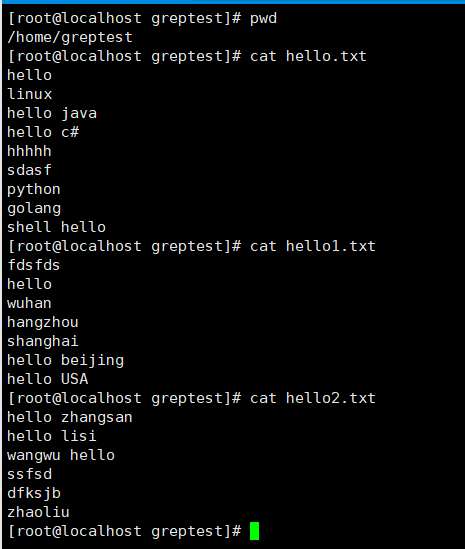

## grep常用操作

### 打印行号	-n

```bash
grep -n ".*" hello.txt		文件所有行号
grep -n "hello" hello.txt 	匹配到的内容的行号
```

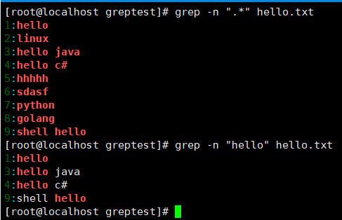

### 仅仅打印需要的东西	-o

```ba
grep -o "hello" hello.txt
```

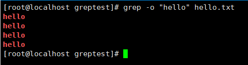

### 忽略大小写	-i

```ba
grep -i "hello" HELLO.txt
```

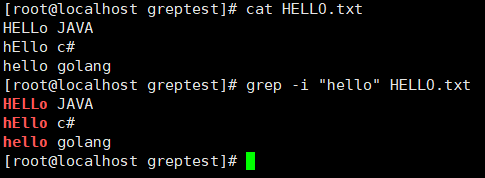

### 统计文件中出现的次数	-c

```bash
grep -c "hello" -i hello.txt
```

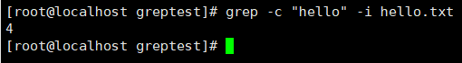

### 搜索特定的字符串 \b

```ba
grep "\broot\b" /etc/passwd
```

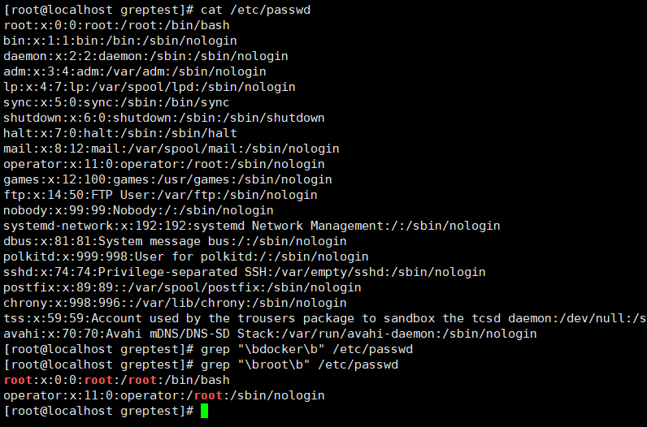

### 在多个文件中查找关键字

```ba
grep "hello" -i HELLO.txt hello.txt hello1.txt 
```

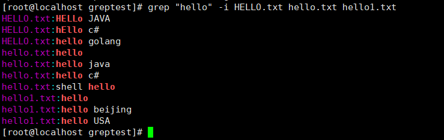

### 输出匹配行和该行之后N行的内容	-A

```ba
grep "linux" -A 3 hello.txt
```

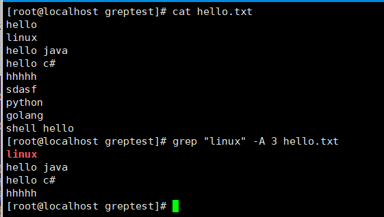

### 输出匹配行和该行之前N行的内容	-B

```ba
grep "hhh" -B 3 hello.txt
```

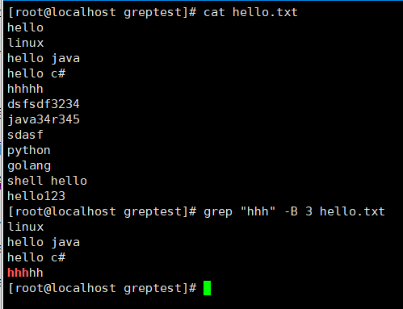

### 输出匹配行和该行之前与之后N行的内容	-c

```ba
grep -C 3 "hhhh" hello.txt
```

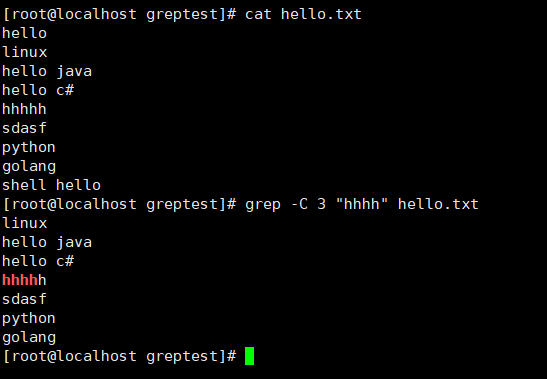

### 反转匹配条件,获取未匹配到的内容	-v

```ba
grep "hello" -v hello.txt 
```

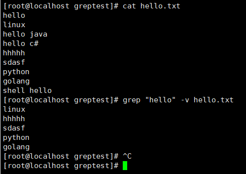

### 递归查询目录下的所有文件	-r

```ba
grep "hello" -r `pwd`
或者
grep "hello" -d recurse `pwd`
```


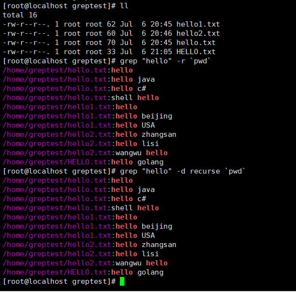

### 递归查询过程中排出某些文件	--exclude

```ba
grep -r --exclude=hello.txt 'hello'
```

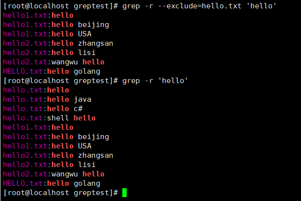

### 输出包含匹配内容的文件名称	-rl

```ba
grep -rl "hello"  `pwd`
```

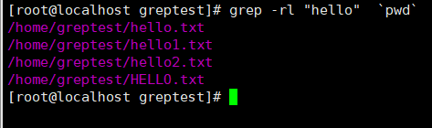

### 只匹配整行内容	-x

```ba
grep -x "hello" hello.txt
```


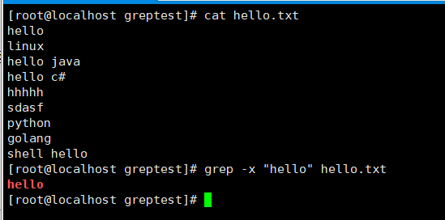


## grep模式部分

### 匹配字符

```te
.:任意一个字符
[abc]:表示匹配一个字符,这个字符必须是abc中的一个
[a-zA-Z]:表示匹配一个字符,这个字符必须是a-z或A-Z这52个字母中的一个
[^123] ：匹配一个字符，这个字符是除了1、2、3以外的所有字符。
系统预定义:
[A-Za-z] 等价于 [[:alpha:]]
[0-9] 等价于 [[:digit:]]
[A-Za-z0-9] 等价于 [[:alnum:]]
tab,space 等空白字符 [[:space:]]
[A-Z] 等价于 [[:upper:]]
[a-z] 等价于 [[:lower:]]
标点符号 [[:punct:]]
```

```ba
grep "hell[[:lower:]]" hello.txt
grep "hello[[:digit:]]" hello.txt 
grep "hello[[:alnum:]]" hello.txt 
```

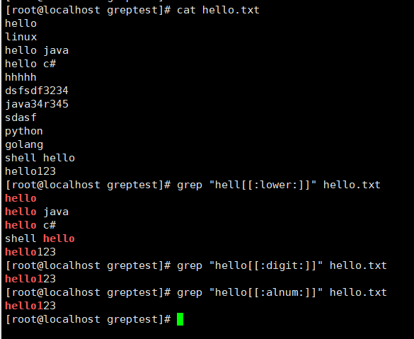

### 匹配次数

```te
\{m,n\} ：匹配其前面出现的字符至少m次，至多n次。
\? ：匹配其前面出现的内容0次或1次，等价于\{0,1\}。
* ：匹配其前面出现的内容任意次，等价于\{0,\}，所以 ".*" 表述任意字符任意次，即无论什么内容全部匹配。
```

```ba
 grep '[[:digit:]]\{1,3\}' hello.txt
```

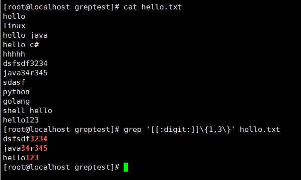