## sed简介

```tex
	sed是一种流编辑器,它是文本处理中非常重要的工具,能够完美的配合正则表达式使用.
	处理时,把当前处理的行存储在临时缓冲区中,称为"模式空间"(pattern space),接着用sed命令处理缓冲区中的内容,处理成功后,把缓冲区的内容送往屏幕显示.接着理下一行,直到文件末尾.文件内容并没有改变.
```


## sed使用说明

```bash
Usage: sed [OPTION]... {script-only-if-no-other-script} [input-file]...

  -n, --quiet, --silent
                 suppress automatic printing of pattern space
  -e script, --expression=script
                 add the script to the commands to be executed
  -f script-file, --file=script-file
                 add the contents of script-file to the commands to be executed
  --follow-symlinks
                 follow symlinks when processing in place
  -i[SUFFIX], --in-place[=SUFFIX]
                 edit files in place (makes backup if SUFFIX supplied)
  -c, --copy
                 use copy instead of rename when shuffling files in -i mode
  -b, --binary
                 does nothing; for compatibility with WIN32/CYGWIN/MSDOS/EMX (
                 open files in binary mode (CR+LFs are not treated specially))
  -l N, --line-length=N
                 specify the desired line-wrap length for the `l' command
  --posix
                 disable all GNU extensions.
  -r, --regexp-extended
                 use extended regular expressions in the script.
  -s, --separate
                 consider files as separate rather than as a single continuous
                 long stream.
  -u, --unbuffered
                 load minimal amounts of data from the input files and flush
                 the output buffers more often
  -z, --null-data
                 separate lines by NUL characters
  --help
                 display this help and exit
  --version
                 output version information and exit

If no -e, --expression, -f, or --file option is given, then the first
non-option argument is taken as the sed script to interpret.  All
remaining arguments are names of input files; if no input files are
specified, then the standard input is read.

GNU sed home page: <http://www.gnu.org/software/sed/>.
General help using GNU software: <http://www.gnu.org/gethelp/>.
E-mail bug reports to: <bug-sed@gnu.org>.
Be sure to include the word ``sed'' somewhere in the ``Subject:'' field.
```


## 测试文件准备

test.txt

```tex
1	图书、音像、电子书刊	0	1	1
2	电子书刊	1	1	1
3	电子书	2	0	1
4	网络原创	2	0	2
5	数字杂志	2	0	3
6	多媒体图书	2	0	4
7	音像	1	1	2
8	音乐	7	0	1
9	影视	7	0	2
10	教育音像	7	0	3
11	英文原版	1	1	3
12	少儿	11	0	1
13	商务投资	11	0	2
14	英语学习与考试	11	0	3
```

## sed常用操作

### sed常见命令参数

```tex
p==print
d:delete
=:打印匹配行的行号
-n 取消默认的完整输出,只输出需要的
-e 允许多项编辑
-i 修改文件内容
-r 不需要转义
注意: &符号在sed命令中代表上次匹配的结果
```

### sed命令功能

```tex
命令     功能
a\       在当前行后添加一行或多行.多行时除最后一行外,没行末尾需用"\"续行
c\       用此符号后的新文本替换当前行中的文本.多行时除最后一行外,每行末尾需用"\"续行
i\       在当前行之前插入文本.多行时出最后一行外,每行末尾需用"\"续行
d        删除行
h        把模式空间里的内容复制到暂存缓冲区
H        把模式空间里的内容追加到暂存缓冲区
g        把暂存缓冲区的内容追加到模式空间里,追加在原有内容的后面
l        列出非打印字符
p       打印行
n       读入下一输入行,并从下一条命令而不是第一条命令开始对其的处理
q       结束或退出sed
r       从文件中读取输入行
!       对所选行以外的所有行应用命令
s       用一个字符串替换另一个
g       在行内进行全局替换
w       将所选的行写入文件
x       交换暂存缓冲区与模式空间的内容
y       将字符替换为另一字符(不能对正则表达式使用y命令)
```


### sed常见操作命令

#### 只输出文件第三行

```bash
sed -n '3p' test.txt
```

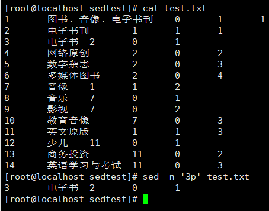

#### 输出文件3-9行

```bash
sed -n '3,9p' test.txt
```

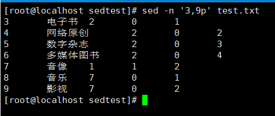

#### 过滤特定字符串

```bash
sed -n '/电子/p' test.txt
```

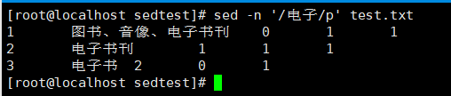

#### 显示包含"网络"的行到包含"少儿"的行之间的所有行

```bash
sed -n '/网络/,/少儿/p' test.txt 
```

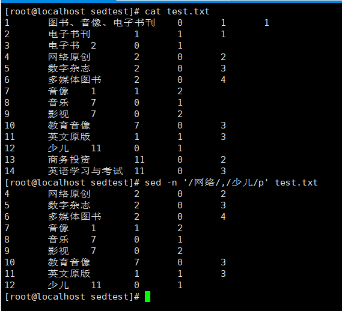

#### 打印匹配行的内容和符号

```bash
sed -n -e '/少儿/=' -e '/少儿/p' test.txt
```

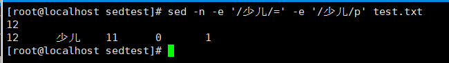

用"movie"替换"影视"

```bash
sed -i 's/影视/movie/g' test.txt 
```

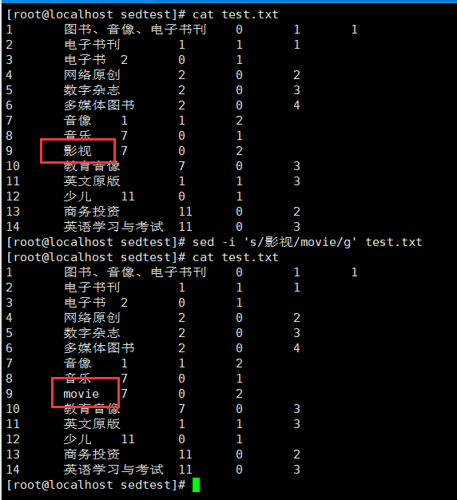

#### 打印文件最后一行

```bash
sed -n '$p' test.txt
```

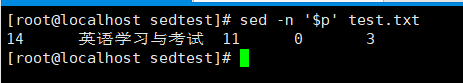

#### 在文件第一行添加"---begin---",在文件结尾添加"---end---"(源文件不发生变化)

```bash
sed -e '1i ---begin---' -e '$a ---end---' test.txt
```

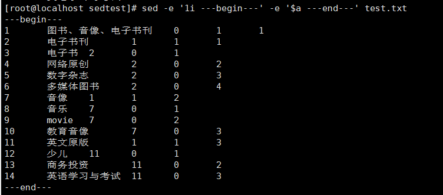

#### 在文件1-4行添加"---------------"

```bash
sed '1,4i ---------------' test.txt 
```

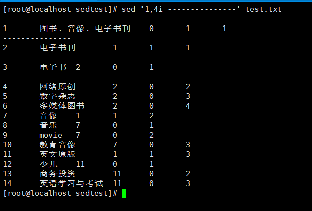

#### &符号代表上次匹配的结果

```bash
sed 's/电子/---&---/g' test.txt
```

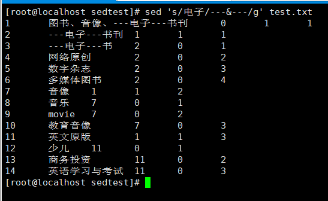

#### 删除五到七行

```bash
sed '5,7d' test.txt
```

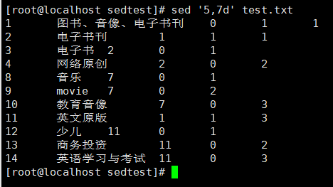

#### 删除包含"音乐"到包含"商务投资"行之间的数据

```bash
sed '/音乐/,/商务投资/d' test.txt 
```

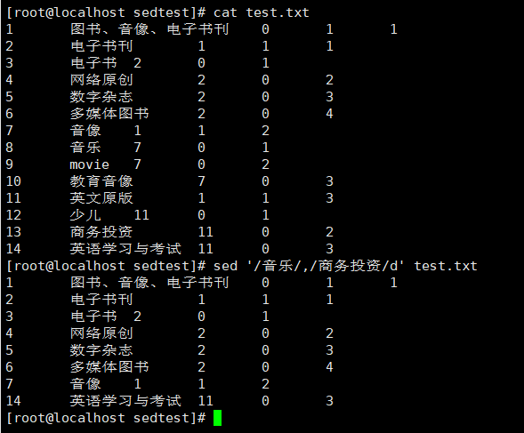

#### 删除包含""的行到第九行的内容

```bash
sed '/数字/,10d' test.txt
```

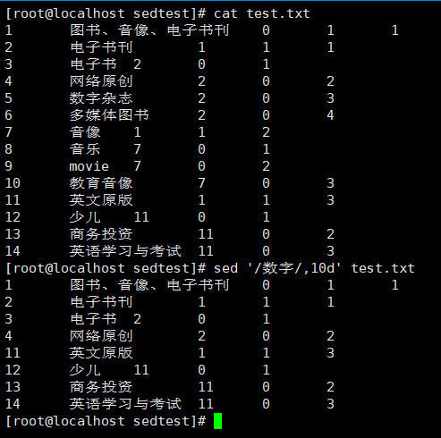

#### 将1-10行中 "电子" 替换成 "000电子000" 显示

```bash
sed '1,10 s/电子/000电子000/g' test.txt
```

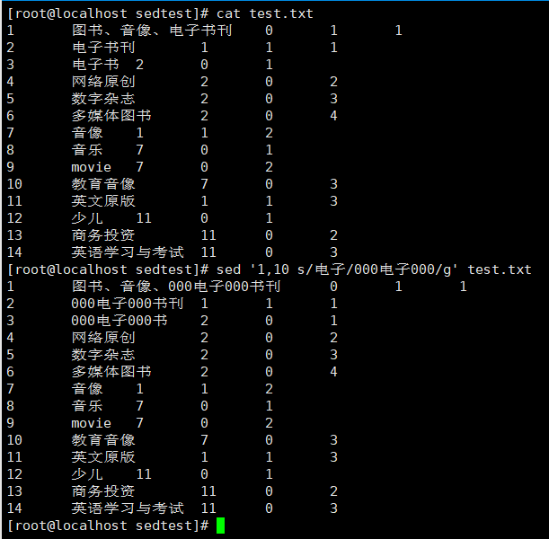

#### 将tmp.txt文件中的内容插入到test.txt文件中包含"英文原版"的行下面

```bash
sed '/英文原版/ r tmp.txt' test.txt
```

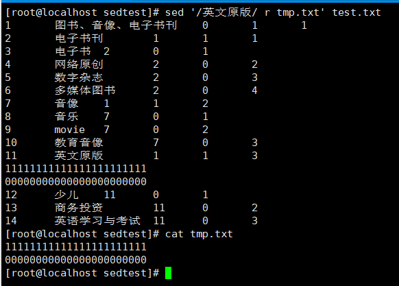