# Hexo博客搭建

## 安装依赖环境

### nodejs环境

### npm(cnpm)环境

### hexo安装

​	`cnpm install -g hexo-cli`

​	`验证安装是否成功:  hexo -v`

### 建立文件夹(F:\hexo)

### 初始化hexo

​	`hexo init`

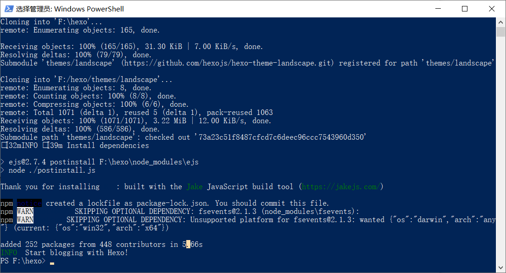


### 启动博客

​	`hexo s`

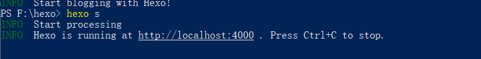

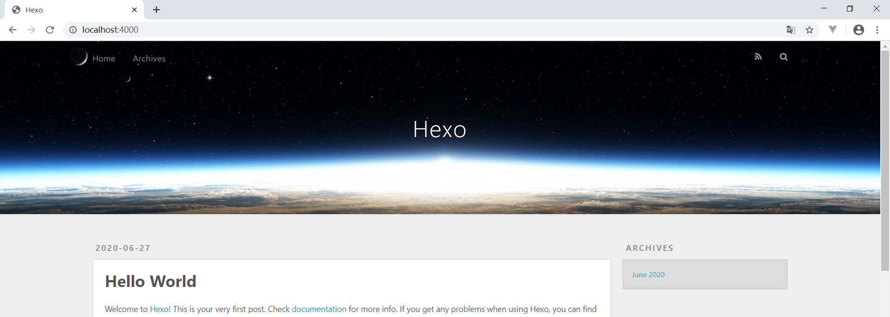

### 写文章

​	`hexo new "stream for JDK8"`

​	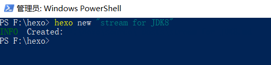

### 修改文章内容,生成页面

​	`hexo clean`

​	`hexo g`

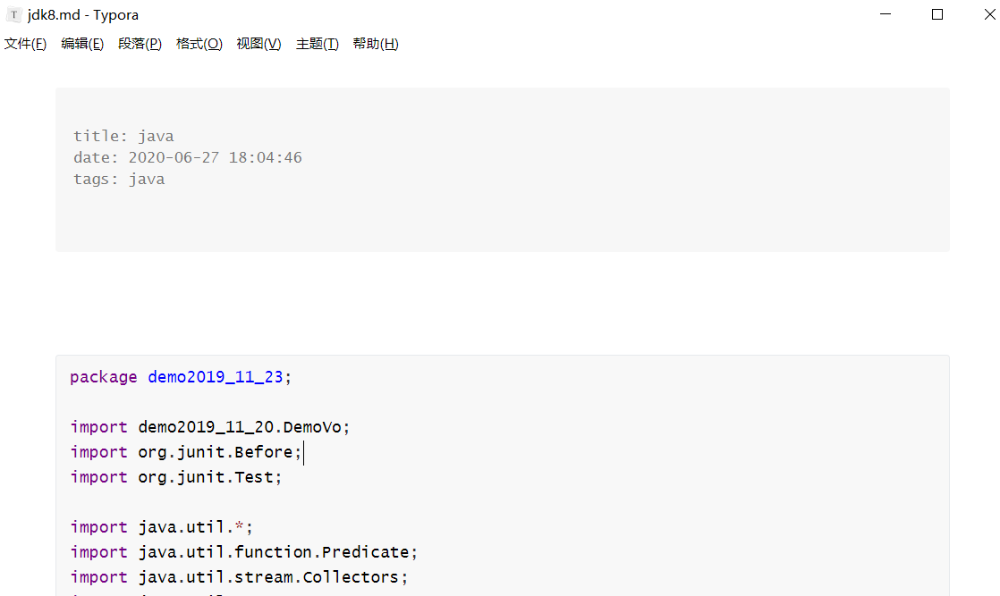

### 重启hexo服务

​	`hexo s`

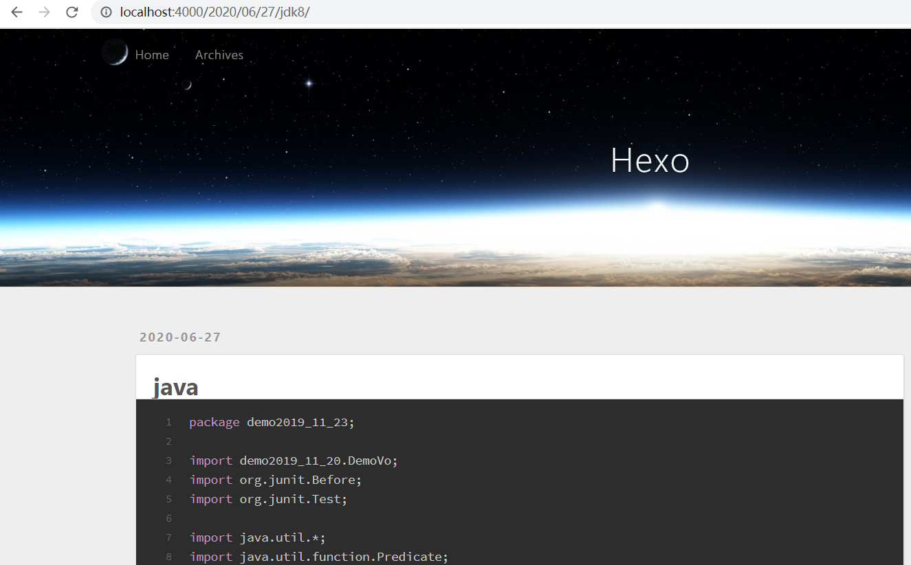

### 部署hexo到github

#### 下载hexo-deployer-git工具

​		`cnpm install --save hexo-deployer-git`

#### 设置_config.yml文件

​	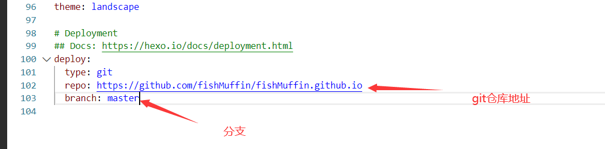

#### 部署

​	`hexo d`

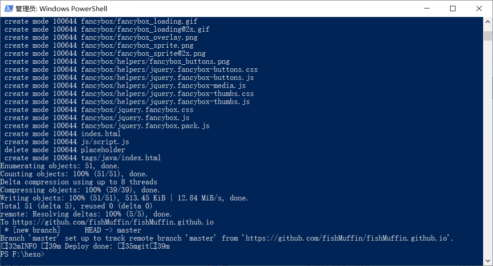

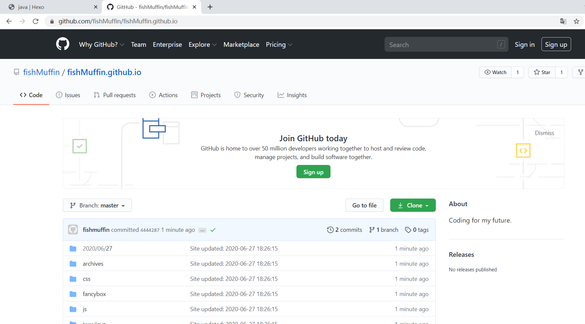

#### github域名网页浏览(https://fishmuffin.github.io/)

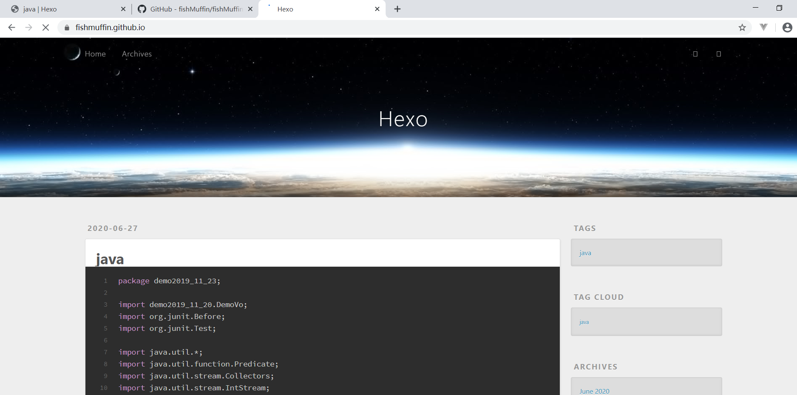


### 切换主题(https://github.com/litten/hexo-theme-yilia)

#### 下载主题到themes文件夹

`git clone https://github.com/litten/hexo-theme-yilia themes/yilia`

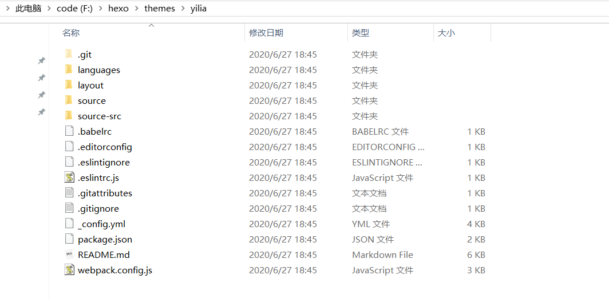

#### 配置_config.yml文件

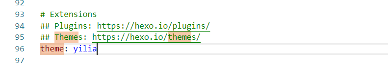

#### 重新部署hexo

`hexo clean`

`hexo g`

`hexo s`

`hexo d`

### 图片无法跟随上传到git解决方案

#### 将配置`_config.yml`里面的`post_asset_folder:false`这个选项设置为`true`。

#### 安装hexo-assert-image插件

`npm install https://github.com/7ym0n/hexo-asset-image --sa`


### hexo中如何使用emoji表情

markdown和html可以互相转换,hexo中的默认markdow渲染器是`hexo-render-marked`,它不支持emoji表情.如果要使用emoji,只需要换一个支持emoji的markdown渲染器就行了.

```bash
npm un hexo-renderer-marked --save
npm i hexo-renderer-markdown-it --save
npm install markdown-it-emoji --save
```

安装完了之后需要配置`_config.yml`配置文件,注意不是主题的配置文件.

```yml
markdown:
  plugins:
    - markdown-it-footnote
    - markdown-it-sup
    - markdown-it-sub
    - markdown-it-abbr
    - markdown-it-emoji
```

更多配置可以查看:https://github.com/hexojs/hexo-renderer-markdown-it/wiki/


